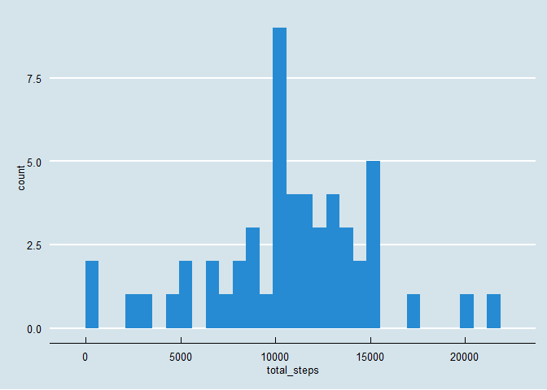
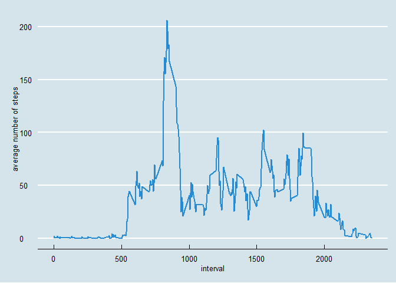
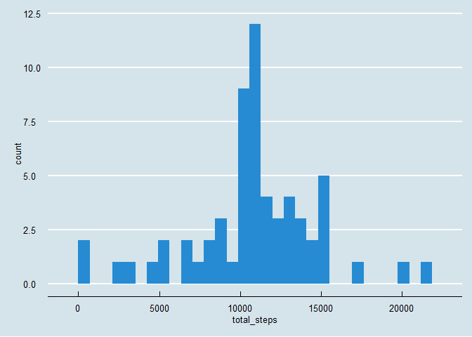
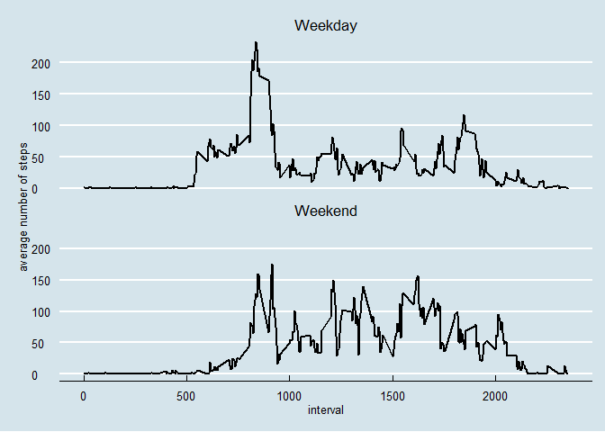

# Reproducible Research: Peer Assessment 1


## Loading and preprocessing the data

Below is the code to:

#### Load the data (i.e. read.csv())

The data is loaded from an archive that is contained in the repository so no download is necessary. The archive will be extracted if needed.


```r
# import dplyr to help with data manipulation
library(dplyr)

# the archive name
local_data_source <- "activity.zip"
# the actual data file
file_name <- "activity.csv"

# unzip it if needed
if (!file.exists(file_name)){
    unzip(local_data_source)
}

# data frame containing all the data (n.a. and all)
ds <- read.csv(file_name)
```

#### Process/transform the data into a format suitable for the analysis

From the initial data frame we create the other data frames needed for the analysis:
* one containing only complete cases
* one grouped by day
* one grouped by interval


```r
# filter only the complete cases
cds <- ds[complete.cases(ds),]

# summarize the steps by day
csd_StepsByDay <- group_by(cds, date) %>% summarise(total_steps = sum(steps))

# summarize the steps by interval, n.b.: this contains incomplete cases
csd_StepsByInterval <- group_by(ds, interval) %>% summarise(mean_steps = mean(steps, na.rm = TRUE))
```


## What is mean total number of steps taken per day?

Below is the code to:

#### Make a histogram of the total number of steps taken each day


```r
# import ggplot2 to make pretty graphs
library(ggplot2)
# import ggthemes to give us some themes
library(ggthemes)

# define in a single place the themes we'll use for all the graphs
gscaletheme <- scale_color_solarized
gfilltheme <- scale_fill_solarized
gtheme <- theme_economist

# compute the mean and median for later printing inline
total_steps_mean = mean(csd_StepsByDay$total_steps)
total_steps_median = median(csd_StepsByDay$total_steps)
# only use scientific notation afer 1M, and show 2 digits
options(scipen = 6, digits = 2)

# plot a histogram of steps by day
plot_hist_sbd <- ggplot(csd_StepsByDay, aes(x=total_steps, fill="")) + geom_bar() +
    gtheme() +
    gscaletheme() +
    gfilltheme()+
    gfilltheme(guide=FALSE)
```

The histogram plot:


```r
print(plot_hist_sbd)
```

 

#### Calculate and report the mean and median total number of steps taken per day

The mean of the total number of steps taken per day is 10766.19, the median is 10766.19.


## What is the average daily activity pattern?


Below is the code to:

#### Make a time series plot (i.e. type = "l") of the 5-minute interval (x-axis) and the average number of steps taken, averaged across all days (y-axis)


```r
plot_line_sbi <- ggplot(csd_StepsByInterval, aes(x=interval, y=mean_steps, color = "")) +
    geom_line(size = 1) +
    gtheme() +
    gscaletheme() +
    gfilltheme() +
    scale_y_continuous("average number of steps")+
    gscaletheme(guide=FALSE)
print(plot_line_sbi)
```

 

#### Which 5-minute interval, on average across all the days in the dataset, contains the maximum number of steps?


```r
max_steps_interval <- csd_StepsByInterval[csd_StepsByInterval$mean_steps == max(csd_StepsByInterval$mean_steps), "interval"]
```

The 5-minute interval that, on average across all the days in the dataset, contains the maximum number of steps is 835.


## Imputing missing values

#### Calculate and report the total number of missing values in the dataset (i.e. the total number of rows with NAs)

We extract the observations with missing data in a separate data frame for alter processing.


```r
missing_count <- nrow(ds[!complete.cases(ds),])
```

The total number of rows with NAs is 2304.

#### Devise a strategy for filling in all of the missing values in the dataset. The strategy does not need to be sophisticated. For example, you could use the mean/median for that day, or the mean for that 5-minute interval, etc.

We create a new data frame by filling the missing values using the mean for that 5-minute interval.


```r
# find the rows with missing data
missing_data_ds <- ds[!complete.cases(ds),]
# fill in the missing values as the mean of the same interval from complete days
filled_data_ds <- inner_join(select(missing_data_ds, -steps), csd_StepsByInterval) %>%
                        mutate(steps = mean_steps) %>%
                        select(steps, date, interval)
```

#### Create a new dataset that is equal to the original dataset but with the missing data filled in.


```r
# bind together the rows of the complete data set and the filled in data set
fds <- rbind(cds, filled_data_ds)
```

#### Make a histogram of the total number of steps taken each day and Calculate and report the mean and median total number of steps taken per day. Do these values differ from the estimates from the first part of the assignment? What is the impact of imputing missing data on the estimates of the total daily number of steps?


```r
# summarize the steps by day
fds_StepsByDay <- group_by(fds, date) %>% summarise(total_steps = sum(steps))

# compute the mean and median for later printing inline
ftotal_steps_mean = mean(fds_StepsByDay$total_steps)
ftotal_steps_median = median(fds_StepsByDay$total_steps)

# plot a histogram of steps by day
plot_hist_fds <- ggplot(fds_StepsByDay, aes(x=total_steps, fill="")) + geom_bar() +
    gtheme() +
    gscaletheme() +
    gfilltheme()+
    gfilltheme(guide=FALSE)
```

The histogram plot:


```r
print(plot_hist_fds)
```

 

The mean of the total number of steps taken per day is 10766.19, the median is 10766.19. The original values where 10766.19 and 10765. By filling in the missing data the mean is lower and the median is higher.

## Are there differences in activity patterns between weekdays and weekends?

#### Create a new factor variable in the dataset with two levels - "weekday" and "weekend" indicating whether a given date is a weekday or weekend day.


```r
cds_wd <- mutate(cds, WeekDayName = weekdays(as.POSIXlt(date))) %>%
    mutate(WeekDayType = ifelse(WeekDayName %in% c("Saturday", "Sunday"), "Weekend", "Weekday") ) %>%
    select(WeekDayType, WeekDayName, interval, steps) %>%
    group_by(interval, WeekDayType) %>%
    summarise(mean_steps = mean(steps, na.rm = TRUE))
```

#### Make a panel plot containing a time series plot (i.e. type = "l") of the 5-minute interval (x-axis) and the average number of steps taken, averaged across all weekday days or weekend days (y-axis). 


```r
plot_wd_cds <- ggplot(cds_wd, aes(interval, mean_steps))+
    facet_wrap(~WeekDayType, ncol=1)+
    geom_line(size = 1) +
    gtheme() +
    gscaletheme() +
    gfilltheme() +
    scale_y_continuous("average number of steps")+
    gscaletheme(guide=FALSE)
print(plot_wd_cds)
```

 
